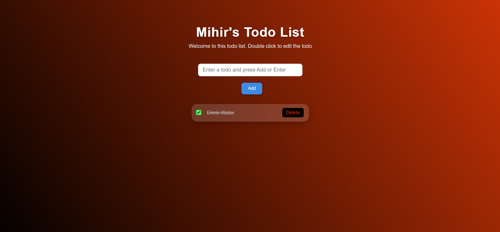

# 📝 To-Do List Web App

A simple and clean **To-Do List application** built using **HTML, CSS, and JavaScript** that helps users manage daily tasks efficiently.

## 🚀 Features

* Add new tasks
* Mark tasks as completed
* Delete tasks
* Clean and minimal user interface
* Lightweight and fast (no frameworks used)

## 🛠️ Built With

* HTML
* CSS
* JavaScript (Vanilla JS)

## 📸 Screenshot

## 📂 Project Structure
.
├── index.html
├── style.css
├── script.js
└── screenshot.png

## 📌 Description

This project is a beginner-friendly task management web application.
It allows users to organize their daily tasks in a simple and interactive interface using basic web technologies.

## 👨‍💻 Author

Mihir
